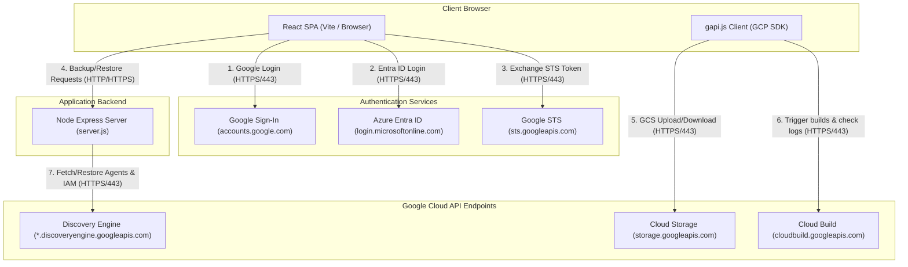
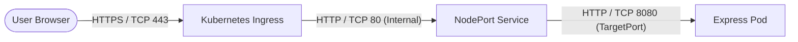

# Gemini Enterprise Backup & Recovery App

## 1. Overview

This application provides self-service backup and recovery capabilities for Gemini Enterprise configurations, focusing on Search/Chat Engines, Assistants, low-code Agents, Notebooks, and Chat History archives. It facilitates multi-environment deployments, sequential account switching for cross-identity provider (IDP) migrations, and automated remapping of external connectors (such as SharePoint or Google Drive).

### Modes of Operation

The application supports three distinct modes of operation depending on configuration flags:

#### 1. Admin Mode
*   **When to use**: When you need to configure target environment mappings, discover/load active data assets, and generate configuration settings.
*   **Flags needed**: `VITE_ENABLE_ADMIN_MODE=true`
*   **How to use**: This unlocks the "Admin View" tab in the dashboard, enabling administrators to manage environmental mappings and export configuration templates.

#### 2. User Only with Single IDP
*   **When to use**: When regular users want to backup or restore their personal agents and notebooks within the same Identity Provider without changing login credentials.
*   **Flags needed**: `VITE_IDP_CHANGE_ENABLED=false` and `VITE_ENABLE_ADMIN_MODE=false`.
*   **How to use**: Users operate in the simplified "User View", clicking "Backup My Data" to download their agent configuration and "Restore My Data" to re-import it.

#### 3. Cross-IDP Mode
*   **When to use**: When migrating resources across different Google Cloud organizations or identity providers (e.g., from Google Accounts to Microsoft Entra ID via Workforce Identity Federation) where simultaneous login is not possible.
*   **Flags needed**: `VITE_IDP_CHANGE_ENABLED=true`
*   **How to use**: Activates a 4-step guided migration workflow:
    1.  **Backup**: Log in to the source account, select resources, and download the configuration archive.
    2.  **Switch Accounts**: Sign out and sign in using the target account/IDP.
    3.  **Verify Connectors**: Test authentication bridges in the target environment.
    4.  **Restore**: Upload the source archive, map collections/datastores, and run restoration.

### Key Limitations
*   **Draft Status**: Restored agents are created in **Draft** status; they must be manually reviewed and published in the target project.
*   **Local Files**: Local files attached to Notebooks are not backed up and must be manually re-uploaded.
*   **Sharing Permissions**: IAM bindings for personal resources do not automatically translate across different IDPs; permissions must be updated manually.
*   **Unmapped Datastores**: If a datastore has no target mapping defined, its connections are skipped and reported in the post-restore summary.
*   **Stateless Server**: When deployed to serverless environments (like Cloud Run), dynamically modified admin configurations are not persisted on-disk. Administrators must download the exported `.env.exported` and commit it.

---

## 2. Architecture & How It Works

The application decouples lightweight configuration management (client-side) from resource-heavy parallel API processing (server-side).

### Component Architecture



### Client-Side App (React SPA)
*   **State Management**: Access tokens and user profiles are held strictly in `sessionStorage` to mitigate Cross-Site Scripting (XSS) risks.
*   **Direct-to-GCP Operations**: Utilizes Google's client-side API loader (`gapi.js`) to directly list GCS buckets, stream objects, and query Cloud Build logs, avoiding backend bottlenecks.
*   **OIDC PKCE Authentication**: Orchestrates browser-popup login flows for Microsoft Entra ID, subsequently querying Google's Security Token Service (STS) to obtain a Google Cloud token for Workforce Identity Federation (WIF).

### Server-Side App (Express Backend)
*   **Static Serving**: Compiles the React SPA and serves the static production build (`/dist`).
*   **Concurrency Management**: Employs a custom dependency-free queue scheduler (`mapConcurrent`) to orchestrate API calls in parallel:
    *   **Backup**: Fetches agent configurations, views, and IAM policies in parallel with a limit of 15 concurrent tasks.
    *   **Restore**: Creates restored agents, resolves data mapping conflicts, and merges IAM permissions with a limit of 10 concurrent tasks.
*   **Payload Transformation**: Dynamically replaces source variables (e.g., project numbers, locations, engine IDs) inside agent JSON schemas before submitting them to the target environment.

---

## 3. Network Ports & Protocols

All communication between the user's browser, the application host, identity providers, and Google Cloud endpoints is secured over SSL/TLS.

### Local Development Network Flow
*   **Frontend Dev Server**: Listens on TCP port `5173` (HTTP). Proxies all calls matching `/api/*` internally to the backend.
*   **Backend Server**: Listens on TCP port `8080` (HTTP).

### GKE Ingress Port Mapping



### Network Endpoints & Ports

| Source | Destination | Hostname / URL | Port | Protocol | Purpose |
| :--- | :--- | :--- | :--- | :--- | :--- |
| User Browser | App Host (Vite Dev) | `localhost` | 5173 | HTTP | Local frontend development server |
| User Browser | App Host (Express) | `localhost` | 8080 | HTTP | Local backend service endpoint |
| User Browser | App Ingress | `backup.ge-dufrin.com` | 443 | HTTPS | Production application entry point |
| User Browser | Google Sign-in | `accounts.google.com` | 443 | HTTPS | Client Google authentication |
| User Browser | Microsoft Entra | `login.microsoftonline.com` | 443 | HTTPS | Client WIF/OIDC identity provider login |
| User Browser | Google STS | `sts.googleapis.com` | 443 | HTTPS | Exchanging identity provider token for GCP access token |
| User Browser | GCS API | `storage.googleapis.com` | 443 | HTTPS | Directly listing and downloading GCS assets |
| User Browser | Cloud Build API | `cloudbuild.googleapis.com` | 443 | HTTPS | Directly tracking agent build details and logs |
| Express Server | Discovery Engine | `*.discoveryengine.googleapis.com` | 443 | HTTPS | Bulk retrieval and creation of agent/engine configurations |

---

## 4. Prerequisites & Permissions

### Minimum IAM Permissions
To execute migrations without requiring project Owner credentials, assign a custom role in **both** source and target projects containing the following permissions:

*   `discoveryengine.engines.list` & `discoveryengine.engines.get`
*   `discoveryengine.assistants.list` & `discoveryengine.assistants.get`
*   `discoveryengine.agents.list` & `discoveryengine.agents.get`
*   `discoveryengine.agents.getAgentView` & `discoveryengine.agents.getIamPolicy`
*   `discoveryengine.agents.create` & `discoveryengine.agents.update`
*   `discoveryengine.agents.deploy` & `discoveryengine.agents.manage`
*   `discoveryengine.notebooks.list` & `discoveryengine.notebooks.get` & `discoveryengine.notebooks.create`
*   `serviceusage.services.use`

You can provision this role using the `gcloud` CLI:
```bash
gcloud iam roles create customBackupViewer \
    --project="YOUR_PROJECT_ID" \
    --title="Discovery Engine Backup Viewer" \
    --description="Least-privilege role required to migrate agents and notebooks." \
    --permissions="discoveryengine.engines.list,discoveryengine.engines.get,discoveryengine.assistants.list,discoveryengine.assistants.get,discoveryengine.agents.list,discoveryengine.agents.get,discoveryengine.agents.getAgentView,discoveryengine.agents.getIamPolicy,discoveryengine.agents.create,discoveryengine.agents.update,discoveryengine.agents.deploy,discoveryengine.agents.manage,discoveryengine.notebooks.list,discoveryengine.notebooks.get,discoveryengine.notebooks.create,serviceusage.services.use" \
    --stage=GA
```

Bind the role to your migrating workforce principal/group:
```bash
gcloud projects add-iam-policy-binding "YOUR_PROJECT_ID" \
    --member="principalSet://iam.googleapis.com/locations/global/workforcePools/YOUR_POOL/group/YOUR_GROUP_ID" \
    --role="projects/YOUR_PROJECT_ID/roles/customBackupViewer"
```

### Identity Provider App Registration (Azure AD / Entra ID)
To enable browser-based login with PKCE, the application registration must be configured as a **Single-Page Application (SPA)**:
1.  Navigate to the [Azure Portal](https://portal.azure.com) -> **Microsoft Entra ID** -> **App registrations**.
2.  Select your App Registration.
3.  Click **Authentication** on the left menu.
4.  Under **Platform configurations**, click **Add a platform** and select **Single-page application (SPA)**.
5.  Set your Redirect URIs (e.g. `http://localhost:5173` for development, `https://backup.ge-dufrin.com` for production).
6.  *Crucial:* If these URIs were previously configured under "Web" or "Implicit Grant", delete them there first. Entra ID does not allow overlapping redirects across Web and SPA platforms.
7.  Save changes.

---

## 5. Setup & Installation

### Option A: Local Development

1.  **Clone the Repository**:
    ```bash
    git clone <repository_url>
    cd Backup_Restore_App
    ```

2.  **Install Dependencies**:
    ```bash
    npm install
    ```

3.  **Configure Environment**:
    Copy the template environment file and fill in your values:
    ```bash
    cp .env.example .env
    ```

4.  **Launch the Servers**:
    Open two terminals to run the frontend and backend side-by-side:
    *   **Terminal 1 (Vite Frontend)**:
        ```bash
        npm run dev
        ```
        The client interface will run on `http://localhost:5173`.
    *   **Terminal 2 (Express Backend)**:
        ```bash
        npm run server
        ```
        The server API will run on `http://localhost:8080`.

---

### Option B: Cloud Run Deployment

You can build and deploy the container to Google Cloud Run:

1.  **Automated Build via Cloud Build**:
    Make sure to configure the `_ALLOWED_ORIGINS` and `_ALLOWED_EMAIL_DOMAIN` substitutions in your Cloud Build trigger UI (see **Security Configurations** below).
    ```bash
    gcloud builds submit --config cloudbuild.yaml
    ```

2.  **Manual Build & Run**:
    ```bash
    # Build container image
    docker build -t gcr.io/YOUR_PROJECT_ID/backup-restore-app:latest .
    
    # Push to Container Registry
    docker push gcr.io/YOUR_PROJECT_ID/backup-restore-app:latest
    
    # Deploy to Cloud Run with CORS origin security enabled
    gcloud run deploy backup-restore-app \
        --image gcr.io/YOUR_PROJECT_ID/backup-restore-app:latest \
        --platform managed \
        --port 8080 \
        --allow-unauthenticated \
        --set-env-vars="ALLOWED_ORIGINS=https://your-cloud-run-url.run.app,ALLOWED_EMAIL_DOMAIN=your-org-domain.com"
    ```

---

## 6. Security Configurations

The application includes server-side request validation (SSRF mitigation), origin validation (CORS restriction), and OAuth Token verification.

### Environment Variables

| Variable | Description | Default | Example |
| :--- | :--- | :--- | :--- |
| `ALLOWED_ORIGINS` | Comma-separated list of origins allowed to perform operations against the backend API. Must match the URL of the deployed application. | `http://localhost:5173` | `https://my-app.us-central1.run.app` |
| `ALLOWED_EMAIL_DOMAIN` | Optional. Domain suffix to restrict access to the backup/restore APIs to users from a specific domain. | (Disabled) | `fedex.com` |

### Configuring Cloud Build Triggers

If deploying via a Cloud Build git-trigger, you should configure these variables using Cloud Build Substitutions:
1. In GCP Console, go to **Cloud Build** > **Triggers**.
2. Edit your trigger.
3. Under **Advanced** > **Substitution variables**, add:
   * Key: `_ALLOWED_ORIGINS` / Value: `https://<your-cloud-run-url>`
   * Key: `_ALLOWED_EMAIL_DOMAIN` / Value: `<your-org-domain>` (optional)
4. Save the changes.

---

### Option C: GKE Deployment - WIP

Kubernetes manifests are located in the `kubernetes/` directory.

1.  **Automated Deploy via Cloud Build**:
    Open `cloudbuild-gke.yaml`, replace `CLUSTER_NAME` and `CLUSTER_ZONE` with your GKE cluster details, and execute:
    ```bash
    gcloud builds submit --config cloudbuild-gke.yaml
    ```

2.  **Manual Kubernetes Manifest Application**:
    *   Build and push the docker image to a registry.
    *   Edit [kubernetes/deployment.yaml](file:///usr/local/google/home/wdufrin/Documents/Code/Backup_Restore_App/kubernetes/deployment.yaml) to point to your pushed image.
    *   Configure dynamic properties if necessary.
    *   Apply manifests to your namespace:
        ```bash
        kubectl apply -f kubernetes/
        ```
    *   Verify the ingress status:
        ```bash
        kubectl get ingress backup-restore-ingress
        ```
        Wait until an IP is assigned to resolve the domain to the cluster.
