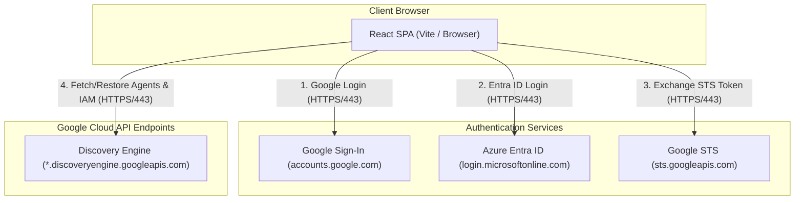

# Gemini Enterprise Backup & Recovery App

## 1. Overview & Architecture

This application provides self-service backup and recovery capabilities for Gemini Enterprise configurations, focusing on Search/Chat Engines, Assistants, low-code Agents, Notebooks, and Chat History archives. It facilitates multi-environment deployments, sequential account switching for cross-identity provider (IDP) migrations, and automated remapping of external connectors (such as SharePoint or Google Drive).

### Modes of Operation
The application supports three distinct modes of operation depending on configuration flags:

#### 1. Admin Mode
*   **When to use**: To configure target environment mappings, discover/load active data assets, and export environment configurations.
*   **Flags needed**: `VITE_ENABLE_ADMIN_MODE=true`
*   **Action**: Unlocks the "Admin View" tab in the dashboard, enabling administrators to manage environmental mappings.

#### 2. User Only with Single IDP
*   **When to use**: When regular users want to backup or restore their personal agents and notebooks within the same Identity Provider without changing login credentials.
*   **Flags needed**: `VITE_IDP_CHANGE_ENABLED=false` and `VITE_ENABLE_ADMIN_MODE=false`.
*   **Action**: Runs in a simplified "User View" permitting users to trigger local configuration downloads and imports.

#### 3. Cross-IDP Mode
*   **When to use**: When migrating resources across different Google Cloud organizations or identity providers (e.g., from Google Accounts to Microsoft Entra ID via WIF) where simultaneous login is not possible.
*   **Flags needed**: `VITE_IDP_CHANGE_ENABLED=true`
*   **Action**: Activates a 4-step guided migration workflow (Backup -> Sign Out -> Sign In Target -> Restore).

### Component Interactions & Topology



### Network Endpoints & Ports

| Source | Destination | Hostname / URL | Port | Protocol | Purpose |
| :--- | :--- | :--- | :--- | :--- | :--- |
| User Browser | App Host (Vite Dev) | `localhost` | 5173 | HTTP | Local frontend development server |
| User Browser | App Ingress | `backup.ge-dufrin.com` | 443 | HTTPS | Production application entry point |
| User Browser | Google Sign-in | `accounts.google.com` | 443 | HTTPS | Client Google authentication |
| User Browser | Microsoft Entra | `login.microsoftonline.com` | 443 | HTTPS | Client WIF/OIDC identity provider login |
| User Browser | Google STS | `sts.googleapis.com` | 443 | HTTPS | Exchanging ID provider tokens for GCP access tokens |
| User Browser | Discovery Engine | `*.discoveryengine.googleapis.com` | 443 | HTTPS | Bulk retrieval and creation of agent/engine configurations |

---

## 2. Security & Data Protection

To comply with enterprise security requirements, this application implements a **client-side only data boundary**:

*   **Zero-Data Host Server**: The hosting container (Cloud Run or GKE) acts strictly as a static web server delivering HTML/JS bundles. No configuration files, credentials, or backup payloads are ever sent to, processed by, or stored on the hosting server.
*   **Encrypted Local Cache**: Backup snapshots are stored in the user's browser local cache (**IndexedDB**). 
*   **AES-GCM Encryption**: All data stored in IndexedDB is encrypted at rest using **256-bit AES-GCM**.
*   **In-Memory Key Management**: The symmetric encryption key is dynamically generated in memory at the time of user login and stored securely in `sessionStorage`. Once the browser tab is closed or the user signs out, the key is permanently destroyed, rendering any cached data in IndexedDB unreadable.

---

## 3. System Requirements & IAM Setup

### Minimum IAM Permissions
API interactions are authenticated using the active OAuth credentials of the end-user. Users executing backup and restore operations need standard Discovery Engine roles:

1. **Backup Operations (Source Project)**
   * **Required Role**: **Discovery Engine User** (`roles/discoveryengine.user`)
   * **Purpose**: Allows the client to view and download playbooks, notebooks, datastores, notes, and generated artifacts (slides/briefings).

2. **Restore Operations (Target Project)**
   * **Required Role**: **Discovery Engine Editor** (`roles/discoveryengine.editor`) or **Discovery Engine Admin** (`roles/discoveryengine.admin`)
   * **Purpose**: Allows the client to create notebooks, upload text/metadata sources, write restored notes, and trigger artifact regeneration.

3. **Quota/Billing Project**
   * **Required Permission**: `serviceusage.services.use` on the billing/quota project (to authenticate API calls).

#### 2. Admin Mode (System Configuration)
Administrators configuring identity providers or client IDs need:
*   **Quota/Billing:** `serviceusage.services.use` (on the quota project)

---

## 4. Workforce Identity Federation (WIF Setup)

To allow users from Okta or Microsoft Entra ID to authenticate directly with Google Cloud APIs from their browser, you must configure a Workforce Identity Pool and OIDC Provider:

### Step 1: Create a Workforce Identity Pool
```bash
gcloud iam workforce-pools create YOUR_POOL_ID \
    --location="global" \
    --description="Workforce Pool for migration administrators" \
    --display-name="Migration Workforce Pool"
```

### Step 2: Configure the OIDC Provider

#### For Microsoft Entra ID
```bash
gcloud iam workforce-pools providers create-oidc YOUR_PROVIDER_ID \
    --workforce-pool="YOUR_POOL_ID" \
    --location="global" \
    --issuer-uri="https://login.microsoftonline.com/YOUR_TENANT_ID/v2.0" \
    --client-id="YOUR_ENTRA_APP_CLIENT_ID" \
    --attribute-mapping="google.subject=assertion.sub,google.groups=assertion.groups,google.display_name=assertion.name" \
    --description="Entra ID Provider" \
    --display-name="Entra ID"
```

#### For Okta
```bash
gcloud iam workforce-pools providers create-oidc YOUR_PROVIDER_ID \
    --workforce-pool="YOUR_POOL_ID" \
    --location="global" \
    --issuer-uri="https://YOUR_OKTA_DOMAIN.okta.com" \
    --client-id="YOUR_OKTA_APP_CLIENT_ID" \
    --attribute-mapping="google.subject=assertion.sub,google.groups=assertion.groups,google.display_name=assertion.name" \
    --description="Okta Provider" \
    --display-name="Okta"
```

> [!IMPORTANT]
> **PKCE Auth and Public Client Constraints**:
> *   **No Client Secrets**: Single-Page Applications (SPAs) cannot securely hold client secrets. Configure your WIF provider as a public client (omit the `--client-secret` flag when creating the provider). The frontend retrieves the OIDC ID Token directly from Okta/Entra ID and exchanges it with the Google Security Token Service (STS).
> *   **Redirect URI Settings**: Entra ID does not allow overlapping redirect URIs across Web and SPA platforms. Redirect URIs for this application must be configured exclusively under the SPA platform settings.

### Step 3: Bind workforce identities to the custom role
```bash
gcloud projects add-iam-policy-binding "YOUR_PROJECT_ID" \
    --member="principalSet://iam.googleapis.com/locations/global/workforcePools/YOUR_POOL_ID/group/YOUR_AD_OR_OKTA_GROUP_NAME" \
    --role="projects/YOUR_PROJECT_ID/roles/customBackupMigrator"
```

---

## 5. Environment Variables Reference

| Variable Name | Required | Default Value | Description |
| :--- | :--- | :--- | :--- |
| `VITE_ENABLE_ADMIN_MODE` | No | `false` | Enables administrative settings and environment mapping UI. |
| `VITE_IDP_CHANGE_ENABLED` | No | `false` | Activates step-by-step account switching for cross-IDP migrations. |
| `VITE_ENABLE_GOOGLE_IDP` | No | `true` | Enables standard Google Account login option. |
| `VITE_GOOGLE_CLIENT_ID` | Yes (if Google IDP is on) | - | OAuth 2.0 Client ID for standard Google accounts authentication. |
| `VITE_GOOGLE_USER_PROJECT` | No | - | Overrides default quota/billing project for standard Google login. |
| `VITE_ENABLE_WIF_IDP` | No | `false` | Enables Workforce Identity Federation (Entra ID) login option. |
| `VITE_ENABLE_OKTA_IDP` | No | `false` | Enables Okta Workforce Identity Federation login option. |
| `VITE_LOG_LEVEL` | No | `INFO` | Adjusts browser logs verbosity (`DEBUG`, `INFO`, `WARN`, `ERROR`). |
| `VITE_SOURCE_PROJECT` | No | - | Default Source GCP Project ID. |
| `VITE_SOURCE_LOCATION` | No | `global` | Default Source Discovery Engine Location (e.g., `global`, `us`). |
| `VITE_TARGET_PROJECT` | No | - | Default Target GCP Project ID. |
| `VITE_TARGET_LOCATION` | No | `global` | Default Target Discovery Engine Location. |
| `VITE_DATASTORE_MAPPING` | No | `{}` | JSON string mapping source datastores to targets. |
| `VITE_COLLECTION_MAPPING` | No | `{}` | JSON string mapping source collections to targets. |

### JSON Mapping Variables Example
When configuring cross-environment migrations, specify mappings as escaped JSON strings:
```env
VITE_DATASTORE_MAPPING='{"old-ds-id":"new-ds-id"}'
VITE_COLLECTION_MAPPING='{"old-col-id":"new-col-id"}'
```

---

## 6. Installation & Quick Start (Local Running)

### Step 1: Clone the Repository
```bash
git clone <repository_url>
cd Backup_Restore_App
```

### Step 2: Install Dependencies
```bash
npm install
```

### Step 3: Configure Local Environment
Create a `.env` file in the root directory:
```bash
cp .env.example .env
```
Fill in your Google Client ID:
```env
VITE_ENABLE_GOOGLE_IDP=true
VITE_GOOGLE_CLIENT_ID=your-google-oauth-client-id.apps.googleusercontent.com
VITE_ENABLE_ADMIN_MODE=true
```

### Step 4: Run the Application
Launch the Vite development server:
```bash
npm run dev
```
Open `http://localhost:5173`.

---

## 7. Production Deployment Guide

### Container Build
Build a static web server Docker image:
```bash
docker build -t gcr.io/YOUR_PROJECT_ID/backup-restore-app:latest .
```

### Option A: Cloud Run Deployment
```bash
gcloud run deploy backup-restore-app \
    --image gcr.io/YOUR_PROJECT_ID/backup-restore-app:latest \
    --platform managed \
    --port 8080 \
    --allow-unauthenticated \
    --set-env-vars="ALLOWED_ORIGINS=https://your-cloud-run-url.run.app,ALLOWED_EMAIL_DOMAIN=your-org-domain.com"
```

### Option B: GKE Deployment
1. Edit [kubernetes/deployment.yaml](file:///usr/local/google/home/wdufrin/Documents/Code/Backup_Restore_App/kubernetes/deployment.yaml) to point to your container registry image path.
2. Deploy manifests:
   ```bash
   kubectl apply -f kubernetes/
   ```

> [!NOTE]
> **Container Host Security**: The container host acts strictly as a static web server. The container's runtime service account does **not** need any GCP IAM permissions, as all API interactions are authenticated via the end-user's browser credentials.

---

## 8. Troubleshooting & Operational Guidance

| Symptom / Error | Potential Cause | Resolution |
| :--- | :--- | :--- |
| **`403: serviceuse.services.use` missing** | The active user credentials lack the permission to make calls billed to the target project. | Provide the `serviceusage.services.use` permission, or set `VITE_GOOGLE_USER_PROJECT` in your `.env` or settings modal to point to a sandbox project where the user has usage permissions. |
| **WIF Sign-In Error: Origin Mismatch (400)** | The Authorized Redirect URI in Entra ID or Okta does not match the active host of the SPA. | Check the identity provider settings and ensure `http://localhost:5173` (development) or `https://backup.ge-dufrin.com` (production) is registered as an SPA redirect URI. |
| **`ReferenceError: indexedDB is not defined`** | The application is running in an environment where IndexedDB is blocked or disabled (such as certain Incognito browser modes). | Run the application in a secure, non-incognito browser tab, or verify that browser cookies/site data are not blocked for the domain. |
| **Restore Failed: datastore not found** | Target project has not provisioned the matching datastore structure. | Verify that datastores are created on the target, and ensure mapping variables (`VITE_DATASTORE_MAPPING`) are correctly set in the admin view. |
