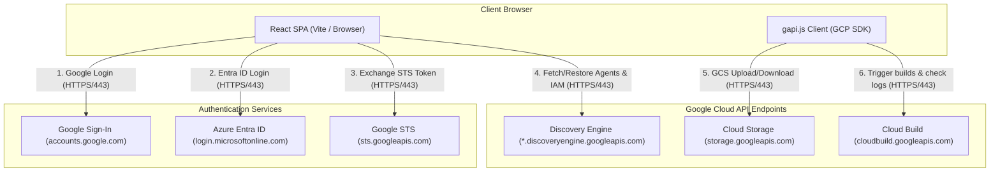

# Gemini Enterprise Backup & Recovery App

## 1. Overview

This application provides self-service backup and recovery capabilities for Gemini Enterprise configurations, focusing on Search/Chat Engines, Assistants, low-code Agents, Notebooks, and Chat History archives. It facilitates multi-environment deployments, sequential account switching for cross-identity provider (IDP) migrations, and automated remapping of external connectors (such as SharePoint or Google Drive).

### Modes of Operation
The application supports three distinct modes of operation depending on configuration flags:

#### 1. Admin Mode
*   **When to use**: To configure target environment mappings, discover/load active data assets, and export environment configurations.
*   **Flags needed**: `VITE_ENABLE_ADMIN_MODE=true`
*   **Action**: Unlocks the "Admin View" tab in the dashboard, enabling administrators to manage environmental mappings.

#### 2. User Only with Single IDP
*   **When to use**: When regular users want to backup or restore their personal agents and notebooks within the same Identity Provider without changing login credentials.
*   **Flags needed**: `VITE_IDP_CHANGE_ENABLED=false` and `VITE_ENABLE_ADMIN_MODE=false`.
*   **Action**: Runs in a simplified "User View" permitting users to trigger local configuration downloads and imports.

#### 3. Cross-IDP Mode
*   **When to use**: When migrating resources across different Google Cloud organizations or identity providers (e.g., from Google Accounts to Microsoft Entra ID via WIF) where simultaneous login is not possible.
*   **Flags needed**: `VITE_IDP_CHANGE_ENABLED=true`
*   **Action**: Activates a 4-step guided migration workflow (Backup -> Sign Out -> Sign In Target -> Restore).

---

## 2. Quick Start (Get Running Locally in < 5 Mins)

Follow these steps to run the application locally using standard Google OAuth login:

### Step 1: Clone the Repository
```bash
git clone <repository_url>
cd Backup_Restore_App
```

### Step 2: Install Dependencies
```bash
npm install
```

### Step 3: Configure Environment Variables
Create a `.env` file in the root directory:
```bash
cp .env.example .env
```
Open `.env` and fill in your Google Client ID (see [Security Configurations](#security-configurations) to obtain one):
```env
VITE_ENABLE_GOOGLE_IDP=true
VITE_GOOGLE_CLIENT_ID=your-google-oauth-client-id.apps.googleusercontent.com
VITE_ENABLE_ADMIN_MODE=true
```

### Step 4: Run the Application
Launch the Vite development server:
```bash
npm run dev
```
Open your browser and navigate to `http://localhost:5173`.

---

## 3. Environment Variables Reference

The following environment variables configure the application during build-time (default settings baked into the bundle). 

> [!NOTE]
> **Local Storage Overrides**: Dynamic overrides set by administrators in the UI (e.g. via the login settings modal or Admin View) are saved directly in the browser's `localStorage` and take precedence over build-time defaults. Clicking the **Reset** button in the UI clears local overrides and restores these default values.

| Variable Name | Required | Default Value | Description |
| :--- | :--- | :--- | :--- |
| `VITE_ENABLE_ADMIN_MODE` | No | `false` | Enables the administrative settings and environment mapping UI. |
| `VITE_IDP_CHANGE_ENABLED` | No | `false` | Activates step-by-step account switching for cross-IDP migrations. |
| `VITE_ENABLE_GOOGLE_IDP` | No | `true` | Enables standard Google Account login option. |
| `VITE_GOOGLE_CLIENT_ID` | Yes (if Google IDP is on) | - | OAuth 2.0 Client ID for standard Google accounts authentication. |
| `VITE_GOOGLE_USER_PROJECT` | No | - | Overrides default quota/billing project for standard Google login. |
| `VITE_ENABLE_WIF_IDP` | No | `false` | Enables Workforce Identity Federation (Entra ID) login option. |
| `VITE_ENABLE_OKTA_IDP` | No | `false` | Enables Okta Workforce Identity Federation login option. |
| `VITE_LOG_LEVEL` | No | `INFO` | Adjusts browser logs verbosity (`DEBUG`, `INFO`, `WARN`, `ERROR`). |
| `VITE_SOURCE_PROJECT` | No | - | Default Source GCP Project ID. |
| `VITE_SOURCE_LOCATION` | No | `global` | Default Source Discovery Engine Location (e.g., `global`, `us`, `eu`). |
| `VITE_TARGET_PROJECT` | No | - | Default Target GCP Project ID. |
| `VITE_TARGET_LOCATION` | No | `global` | Default Target Discovery Engine Location. |
| `VITE_DATASTORE_MAPPING` | No | `{}` | JSON string mapping source datastore IDs to target datastore IDs. |
| `VITE_COLLECTION_MAPPING` | No | `{}` | JSON string mapping source collection IDs to target collection IDs. |

---

## 4. Production Deployment Guide

### Container Build
To package the application as a Docker container:
```bash
docker build -t gcr.io/YOUR_PROJECT_ID/backup-restore-app:latest .
```

### Option A: Cloud Run Deployment
Deploy the container to Google Cloud Run:
```bash
gcloud run deploy backup-restore-app \
    --image gcr.io/YOUR_PROJECT_ID/backup-restore-app:latest \
    --platform managed \
    --port 8080 \
    --allow-unauthenticated \
    --set-env-vars="ALLOWED_ORIGINS=https://your-cloud-run-url.run.app,ALLOWED_EMAIL_DOMAIN=your-org-domain.com"
```

### Option B: GKE Deployment
Apply the Kubernetes manifests located in the `kubernetes/` directory:
1. Edit [kubernetes/deployment.yaml](file:///usr/local/google/home/wdufrin/Documents/Code/Backup_Restore_App/kubernetes/deployment.yaml) to point to your container registry image path.
2. Deploy manifests:
   ```bash
   kubectl apply -f kubernetes/
   ```

> [!NOTE]
> **Container Host Security**: Since this application runs entirely client-side in the user's browser, the container host (Cloud Run / GKE) acts strictly as a static web server. The container's runtime service account does **not** need any GCP IAM permissions, as all API interactions are authenticated via the end-user's browser credentials.

---

## 5. Prerequisites & Security

### Minimum IAM Permissions
The permissions required to use this application are structured based on whether the user is running standard migrations (User Mode) or managing global settings and staging storage (Admin Mode).

#### 1. User Mode (Least-Privilege Migrations)
For standard users executing backup and restore operations, it is assumed they already have the default **Discovery Engine User** role (`roles/discoveryengine.user`). 

To allow them to extract resources from a **Source Project** and recreate them in a **Target Project**, assign a custom role containing the following **additional** permissions (excluding permissions already covered by `roles/discoveryengine.user`):

*   **Source Project (Read-Only Delta):**
    *   `discoveryengine.collections.list` (Discover collections)
    *   `discoveryengine.engines.list` (Discover search apps)
    *   `discoveryengine.datastores.list` (Discover datastores)
    *   `discoveryengine.dataConnectors.get` (Read sync schedules/configs)
    *   `discoveryengine.assistants.list` (Discover chat assistants)
    *   `discoveryengine.assistants.get` (Read assistant templates)
    *   `discoveryengine.notebooks.get` (Read playbook details)
    *   `discoveryengine.agents.getIamPolicy` (Export agent IAM policy)
*   **Target Project (Write/Create Delta):**
    *   *Includes all Source Project Read-Only Delta permissions above*, plus:
    *   `discoveryengine.engines.create` (Provision search apps)
    *   `discoveryengine.engines.update` (Update search apps configuration)
    *   `discoveryengine.datastores.create` (Provision datastores)
    *   `discoveryengine.datastores.update` (Update datastore settings/schemas)
    *   `discoveryengine.dataConnectors.create` (Create sync connectors)
    *   `discoveryengine.dataConnectors.update` (Update connector settings)
    *   `discoveryengine.assistants.create` (Create chat assistants)
    *   `discoveryengine.agents.manage` (Execute Dialogflow agent bundle imports)
    *   `discoveryengine.agents.setIamPolicy` (Restore resource owner IAM bindings)
*   **Quota Project (Quota & Billing):**
    *   `serviceusage.services.use` (Assigned to the user on their own personal sandbox or developer project, which is then specified in the **Google User/Quota Project** settings field).

You can provision the custom user role using the `gcloud` CLI:
```bash
gcloud iam roles create customBackupMigrator \
    --project="YOUR_PROJECT_ID" \
    --title="Discovery Engine Backup Migrator Delta" \
    --description="Additional permissions needed on top of roles/discoveryengine.user to perform backups and restores." \
    --permissions="discoveryengine.collections.list,discoveryengine.engines.list,discoveryengine.datastores.list,discoveryengine.dataConnectors.get,discoveryengine.assistants.list,discoveryengine.assistants.get,discoveryengine.notebooks.get,discoveryengine.agents.getIamPolicy,discoveryengine.engines.create,discoveryengine.engines.update,discoveryengine.datastores.create,discoveryengine.datastores.update,discoveryengine.dataConnectors.create,discoveryengine.dataConnectors.update,discoveryengine.assistants.create,discoveryengine.agents.manage,discoveryengine.agents.setIamPolicy" \
    --stage=GA
```

#### 2. Admin Mode (System Configuration & Cloud Staging)
Administrators configuring identity providers, client IDs, or checking bucket connections need:

*   **Quota/Billing:** `serviceusage.services.use` (on the quota project)
*   **GCS Staging (Optional):** If backing up configurations directly to a shared Google Cloud Storage bucket rather than local client downloads:
    *   `storage.buckets.list` (Discover buckets)
    *   `storage.objects.list` (Discover backups list)
    *   `storage.objects.get` (Download backup file)
    *   `storage.objects.create` (Upload backup file)
    *   `storage.objects.delete` (Delete/prune backup files)

---

## 6. Advanced Identity Provider Configuration (WIF)

To allow users from Okta or Microsoft Entra ID to authenticate directly with Google Cloud APIs from their browser, you must configure a Workforce Identity Pool and OIDC Provider:

### Step 1: Create a Workforce Identity Pool
```bash
gcloud iam workforce-pools create YOUR_POOL_ID \
    --location="global" \
    --description="Workforce Pool for migration administrators" \
    --display-name="Migration Workforce Pool"
```

### Step 2: Configure the OIDC Provider

#### For Microsoft Entra ID
```bash
gcloud iam workforce-pools providers create-oidc YOUR_PROVIDER_ID \
    --workforce-pool="YOUR_POOL_ID" \
    --location="global" \
    --issuer-uri="https://login.microsoftonline.com/YOUR_TENANT_ID/v2.0" \
    --client-id="YOUR_ENTRA_APP_CLIENT_ID" \
    --attribute-mapping="google.subject=assertion.sub,google.groups=assertion.groups,google.display_name=assertion.name" \
    --description="Entra ID Provider" \
    --display-name="Entra ID"
```

#### For Okta
```bash
gcloud iam workforce-pools providers create-oidc YOUR_PROVIDER_ID \
    --workforce-pool="YOUR_POOL_ID" \
    --location="global" \
    --issuer-uri="https://YOUR_OKTA_DOMAIN.okta.com" \
    --client-id="YOUR_OKTA_APP_CLIENT_ID" \
    --attribute-mapping="google.subject=assertion.sub,google.groups=assertion.groups,google.display_name=assertion.name" \
    --description="Okta Provider" \
    --display-name="Okta"
```

> [!IMPORTANT]
> **PKCE Auth and Public Client Constraints**:
> *   **No Client Secrets**: Because Single-Page Applications (SPAs) run entirely in the browser, they cannot securely hold a client secret. The WIF provider must be configured as a public client (omit the `--client-secret` flag when creating the provider). Under this flow, the client retrieves the OIDC **ID Token** directly from Okta/Entra ID and exchanges it with the Google Security Token Service (STS).
> *   **Redirect URI Overlaps**: Entra ID does not allow overlapping redirect URIs across Web and SPA platforms. Ensure redirect URIs for the application are configured exclusively under the SPA platform settings.

### Step 3: Bind workforce identities to the custom role
```bash
gcloud projects add-iam-policy-binding "YOUR_PROJECT_ID" \
    --member="principalSet://iam.googleapis.com/locations/global/workforcePools/YOUR_POOL_ID/group/YOUR_AD_OR_OKTA_GROUP_NAME" \
    --role="projects/YOUR_PROJECT_ID/roles/customBackupMigrator"
```

---

## 7. Architecture & Network Topologies

### Component Interactions



### Network Endpoints & Ports

| Source | Destination | Hostname / URL | Port | Protocol | Purpose |
| :--- | :--- | :--- | :--- | :--- | :--- |
| User Browser | App Host (Vite Dev) | `localhost` | 5173 | HTTP | Local frontend development server |
| User Browser | App Ingress | `backup.ge-dufrin.com` | 443 | HTTPS | Production application entry point |
| User Browser | Google Sign-in | `accounts.google.com` | 443 | HTTPS | Client Google authentication |
| User Browser | Microsoft Entra | `login.microsoftonline.com` | 443 | HTTPS | Client WIF/OIDC identity provider login |
| User Browser | Google STS | `sts.googleapis.com` | 443 | HTTPS | Exchanging ID provider tokens for GCP access tokens |
| User Browser | GCS API | `storage.googleapis.com` | 443 | HTTPS | Directly listing and downloading GCS assets |
| User Browser | Cloud Build API | `cloudbuild.googleapis.com` | 443 | HTTPS | Directly tracking agent build details and logs |
| User Browser | Discovery Engine | `*.discoveryengine.googleapis.com` | 443 | HTTPS | Bulk retrieval and creation of agent/engine configurations |
