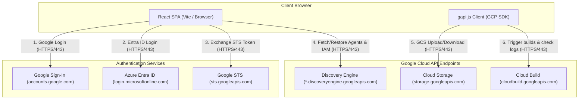
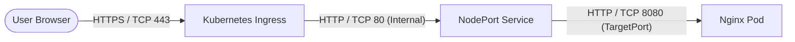

# Gemini Enterprise Backup & Recovery App

## 1. Overview

This application provides self-service backup and recovery capabilities for Gemini Enterprise configurations, focusing on Search/Chat Engines, Assistants, low-code Agents, Notebooks, and Chat History archives. It facilitates multi-environment deployments, sequential account switching for cross-identity provider (IDP) migrations, and automated remapping of external connectors (such as SharePoint or Google Drive).

### Modes of Operation

The application supports three distinct modes of operation depending on configuration flags:

#### 1. Admin Mode
*   **When to use**: When you need to configure target environment mappings, discover/load active data assets, and generate configuration settings.
*   **Flags needed**: `VITE_ENABLE_ADMIN_MODE=true`
*   **How to use**: This unlocks the "Admin View" tab in the dashboard, enabling administrators to manage environmental mappings and export configuration templates.

#### 2. User Only with Single IDP
*   **When to use**: When regular users want to backup or restore their personal agents and notebooks within the same Identity Provider without changing login credentials.
*   **Flags needed**: `VITE_IDP_CHANGE_ENABLED=false` and `VITE_ENABLE_ADMIN_MODE=false`.
*   **How to use**: Users operate in the simplified "User View", clicking "Backup My Data" to download their agent configuration and "Restore My Data" to re-import it.

#### 3. Cross-IDP Mode
*   **When to use**: When migrating resources across different Google Cloud organizations or identity providers (e.g., from Google Accounts to Microsoft Entra ID via Workforce Identity Federation) where simultaneous login is not possible.
*   **Flags needed**: `VITE_IDP_CHANGE_ENABLED=true`
*   **How to use**: Activates a 4-step guided migration workflow:
    1.  **Backup**: Log in to the source account, select resources, and download the configuration archive.
    2.  **Switch Accounts**: Sign out and sign in using the target account/IDP.
    3.  **Verify Connectors**: Test authentication bridges in the target environment.
    4.  **Restore**: Upload the source archive, map collections/datastores, and run restoration.

### Key Limitations
*   **Draft Status**: Restored agents are created in **Draft** status; they must be manually reviewed and published in the target project.
*   **Local Files**: Local files attached to Notebooks are not backed up and must be manually re-uploaded.
*   **Sharing Permissions**: IAM bindings for personal resources do not automatically translate across different IDPs; permissions must be updated manually.
*   **Unmapped Datastores**: If a datastore has no target mapping defined, its connections are skipped and reported in the post-restore summary.
*   **Stateless Server**: When deployed to serverless environments (like Cloud Run), dynamically modified admin configurations are not persisted on-disk. Administrators must download the exported `.env.exported` and commit it.

---

## 2. Architecture & How It Works

The application runs entirely client-side as a Single Page Application (SPA) in the user's browser, executing all operations directly against Google Cloud endpoints and identity providers.

### Component Architecture



### Client-Side App (React SPA)
*   **State Management**: Access tokens and user profiles are held strictly in `sessionStorage` to mitigate Cross-Site Scripting (XSS) risks.
*   **Direct-to-GCP Operations**: Utilizes Google's client-side API loader (`gapi.js`) and direct authenticated browser fetches to interact with GCS, check Cloud Build logs, and query Discovery Engine.
*   **OIDC PKCE Authentication**: Orchestrates browser-popup login flows for Microsoft Entra ID / Okta, subsequently querying Google's Security Token Service (STS) to obtain a Google Cloud token for Workforce Identity Federation (WIF).
*   **Concurrency Management**: Runs a client-side concurrency loop (`mapConcurrent`) to retrieve agent resources and restore configs in parallel batches without overloading network streams.

---

## 3. Network Ports & Protocols

All communication between the user's browser, the application host, identity providers, and Google Cloud endpoints is secured over SSL/TLS.

### Local Development Network Flow
*   **Frontend Dev Server**: Listens on TCP port `5173` (HTTP).

### GKE Ingress Port Mapping



### Network Endpoints & Ports

| Source | Destination | Hostname / URL | Port | Protocol | Purpose |
| :--- | :--- | :--- | :--- | :--- | :--- |
| User Browser | App Host (Vite Dev) | `localhost` | 5173 | HTTP | Local frontend development server |
| User Browser | App Ingress | `backup.ge-dufrin.com` | 443 | HTTPS | Production application entry point |
| User Browser | Google Sign-in | `accounts.google.com` | 443 | HTTPS | Client Google authentication |
| User Browser | Microsoft Entra | `login.microsoftonline.com` | 443 | HTTPS | Client WIF/OIDC identity provider login |
| User Browser | Google STS | `sts.googleapis.com` | 443 | HTTPS | Exchanging identity provider token for GCP access token |
| User Browser | GCS API | `storage.googleapis.com` | 443 | HTTPS | Directly listing and downloading GCS assets |
| User Browser | Cloud Build API | `cloudbuild.googleapis.com` | 443 | HTTPS | Directly tracking agent build details and logs |
| User Browser | Discovery Engine | `*.discoveryengine.googleapis.com` | 443 | HTTPS | Bulk retrieval and creation of agent/engine configurations |

---

## 4. Prerequisites & Permissions

### Minimum IAM Permissions
To execute migrations without requiring project Owner credentials, assign a custom role in **both** source and target projects containing the following permissions:

*   **Discovery Engine**: `discoveryengine.collections.list`, `discoveryengine.engines.list`, `discoveryengine.engines.get`, `discoveryengine.assistants.list`, `discoveryengine.assistants.get`, `discoveryengine.agents.list`, `discoveryengine.agents.get`, `discoveryengine.agents.getAgentView`, `discoveryengine.agents.getIamPolicy`, `discoveryengine.agents.create`, `discoveryengine.agents.update`, `discoveryengine.agents.setIamPolicy`, `discoveryengine.agents.manage`, `discoveryengine.dataStores.list`, `discoveryengine.dataConnectors.get`, `discoveryengine.notebooks.list`, `discoveryengine.notebooks.get`, `discoveryengine.notebooks.create`
*   **AI Platform / Agent Engine**: `aiplatform.reasoningEngines.list`
*   **Google Cloud Storage**: `storage.buckets.list`, `storage.objects.list`, `storage.objects.get`, `storage.objects.create`, `storage.objects.delete`
*   **Service Usage**: `serviceusage.services.use`

You can provision this role using the `gcloud` CLI:
```bash
gcloud iam roles create customBackupViewer \
    --project="YOUR_PROJECT_ID" \
    --title="Discovery Engine Backup Viewer" \
    --description="Least-privilege role required to migrate engines, agents, notebooks, and reasoning engines." \
    --permissions="discoveryengine.collections.list,discoveryengine.engines.list,discoveryengine.engines.get,discoveryengine.assistants.list,discoveryengine.assistants.get,discoveryengine.agents.list,discoveryengine.agents.get,discoveryengine.agents.getAgentView,discoveryengine.agents.getIamPolicy,discoveryengine.agents.create,discoveryengine.agents.update,discoveryengine.agents.setIamPolicy,discoveryengine.agents.manage,discoveryengine.dataStores.list,discoveryengine.dataConnectors.get,discoveryengine.notebooks.list,discoveryengine.notebooks.get,discoveryengine.notebooks.create,aiplatform.reasoningEngines.list,storage.buckets.list,storage.objects.list,storage.objects.get,storage.objects.create,storage.objects.delete,serviceusage.services.use" \
    --stage=GA
```

### Google Cloud Workforce Identity Federation (WIF) Setup
To allow users from Okta or Entra ID to authenticate directly with Google Cloud APIs from their browser, you must set up a Workforce Identity Pool and OIDC Provider:

1. **Create a Workforce Pool**:
   ```bash
   gcloud iam workforce-pools create YOUR_POOL_ID \
       --location="global" \
       --description="Workforce Pool for migration administrators" \
       --display-name="Migration Workforce Pool"
   ```

2. **Configure an OIDC Provider**:
   * **For Microsoft Entra ID**:
     ```bash
     gcloud iam workforce-pools providers create-oidc YOUR_PROVIDER_ID \
         --workforce-pool="YOUR_POOL_ID" \
         --location="global" \
         --issuer-uri="https://login.microsoftonline.com/YOUR_TENANT_ID/v2.0" \
         --client-id="YOUR_ENTRA_APP_CLIENT_ID" \
         --attribute-mapping="google.subject=assertion.sub,google.groups=assertion.groups,google.display_name=assertion.name" \
         --description="Entra ID Provider" \
         --display-name="Entra ID"
     ```
   * **For Okta**:
     ```bash
     gcloud iam workforce-pools providers create-oidc YOUR_PROVIDER_ID \
         --workforce-pool="YOUR_POOL_ID" \
         --location="global" \
         --issuer-uri="https://YOUR_OKTA_DOMAIN.okta.com" \
         --client-id="YOUR_OKTA_APP_CLIENT_ID" \
         --attribute-mapping="google.subject=assertion.sub,google.groups=assertion.groups,google.display_name=assertion.name" \
         --description="Okta Provider" \
         --display-name="Okta"
     ```
     *Note:* If using Okta's default or a custom Authorization Server, append the server path to the issuer URI (e.g. `https://YOUR_OKTA_DOMAIN.okta.com/oauth2/default`).

   > [!IMPORTANT]
   > **Pool Reuse and SPA Flow Constraints**:
   > *   **Microsoft Entra ID (Azure AD)**: If you already have an existing Workforce Pool and OIDC Provider configured for Entra ID, you can reuse the **same pool and provider** without recreating them. Just ensure that the redirect URIs under the SPA platform are enabled in your Entra ID App registration.
   > *   **Okta**: For Okta integrations running client-side, a **new workforce pool and provider must be created specifically for the SPA**.
   > *   **ID Token Exchange (No Secrets)**: Because Single-Page Applications (SPAs) run entirely in the browser, they cannot securely hold a Client Secret. The WIF provider must be configured as a public client (omit the `--client-secret` flag when creating the provider). Under this flow, the client retrieves the OIDC **ID Token** directly from Okta/Entra ID and exchanges it with the Google Security Token Service (STS), rather than performing an authorization code exchange.

3. **Bind IAM Policy**:
   Bind the Custom Viewer role to a specific AD group or Okta group mapped in your pool:
   ```bash
   gcloud projects add-iam-policy-binding "YOUR_PROJECT_ID" \
       --member="principalSet://iam.googleapis.com/locations/global/workforcePools/YOUR_POOL_ID/group/YOUR_AD_OR_OKTA_GROUP_NAME" \
       --role="projects/YOUR_PROJECT_ID/roles/customBackupViewer"
   ```

### Identity Provider App Registration (Azure AD / Entra ID)
To enable browser-based login with PKCE, the application registration must be configured as a **Single-Page Application (SPA)**:
1.  Navigate to the [Azure Portal](https://portal.azure.com) -> **Microsoft Entra ID** -> **App registrations**.
2.  Select your App Registration.
3.  Click **Authentication** on the left menu.
4.  Under **Platform configurations**, click **Add a platform** and select **Single-page application (SPA)**.
5.  Set your Redirect URIs (e.g. `http://localhost:5173` for development, `https://backup.ge-dufrin.com` for production).
6.  *Crucial:* If these URIs were previously configured under "Web" or "Implicit Grant", delete them there first. Entra ID does not allow overlapping redirects across Web and SPA platforms.
7.  Save changes.

### Identity Provider App Registration (Okta)
To enable Okta login with PKCE, the app integration must be configured as a **Single-Page Application (SPA)**:
1.  Log in to your Okta Admin Console.
2.  Navigate to **Applications** -> **Applications** and click **Create App Integration**.
3.  Select **OIDC - OpenID Connect** as the Sign-in method, and select **Single-Page Application (SPA)** as the Application type. Click **Next**.
4.  Set the **App integration name** (e.g., `Gemini Enterprise Backup & Restore`).
5.  Under **Grant type**, ensure **Authorization Code** is checked.
6.  Set the **Sign-in redirect URIs** (e.g. `http://localhost:5173` for development, or the production URL `https://your-cloud-run-url.run.app/`).
7.  Under **Assignments**, select the groups or users who should access the app.
8.  Click **Save**.
9.  In the **General** tab of your new app integration, copy the **Client ID** (this maps to `VITE_OKTA_CLIENT_ID`).
10. Determine your **Auth Endpoint**. For the default Okta authorization server, this is usually `https://<okta-tenant-name>.okta.com/oauth2/default/v1/authorize`. For custom authorization servers or custom domains, adjust the domain and path accordingly (e.g., `https://googlenasc.okta.com/oauth2/v1/authorize`).

---

## 5. Setup & Installation

Deploying the application involves:
1.  **Identity Provider Registration**: Registering the application redirects and permissions in Entra ID (for WIF) and GCP OAuth (for Google Auth).
2.  **IAM Provisioning**: Granting the `customBackupViewer` role to administrators.
3.  **Application Hosting**: Running the Docker container or local server.
4.  **Admin Setup**: Performing the first-time setup and configuring mapping variables.

### Option A: Local Development

1.  **Clone the Repository**:
    ```bash
    git clone <repository_url>
    cd Backup_Restore_App
    ```

2.  **Install Dependencies**:
    ```bash
    npm install
    ```

3.  **Configure Environment**:
    Copy the template environment file and fill in your values:
    ```bash
    cp .env.example .env
    ```

4.  **Launch the Application**:
    Run the Vite development server:
    ```bash
    npm run dev
    ```
    The client interface will run on `http://localhost:5173`.

---

### Option B: Cloud Run Deployment

You can build and deploy the container to Google Cloud Run:

1.  **Automated Build via Cloud Build**:
    Make sure to configure the `_ALLOWED_ORIGINS` and `_ALLOWED_EMAIL_DOMAIN` substitutions in your Cloud Build trigger UI (see **Security Configurations** below).
    ```bash
    gcloud builds submit --config cloudbuild.yaml
    ```

2.  **Manual Build & Run**:
    ```bash
    # Build container image
    docker build -t gcr.io/YOUR_PROJECT_ID/backup-restore-app:latest .
    
    # Push to Container Registry
    docker push gcr.io/YOUR_PROJECT_ID/backup-restore-app:latest
    
    # Deploy to Cloud Run with CORS origin security enabled
    gcloud run deploy backup-restore-app \
        --image gcr.io/YOUR_PROJECT_ID/backup-restore-app:latest \
        --platform managed \
        --port 8080 \
        --allow-unauthenticated \
        --set-env-vars="ALLOWED_ORIGINS=https://your-cloud-run-url.run.app,ALLOWED_EMAIL_DOMAIN=your-org-domain.com"
    ```

---

### Option C: GKE Deployment

Kubernetes manifests are located in the `kubernetes/` directory.

1.  **Automated Deploy via Cloud Build**:
    Open `cloudbuild-gke.yaml`, replace `CLUSTER_NAME` and `CLUSTER_ZONE` with your GKE cluster details, and execute:
    ```bash
    gcloud builds submit --config cloudbuild-gke.yaml
    ```

2.  **Manual Kubernetes Manifest Application**:
    *   Build and push the docker image to a registry.
    *   Edit [kubernetes/deployment.yaml](file:///usr/local/google/home/wdufrin/Documents/Code/Backup_Restore_App/kubernetes/deployment.yaml) to point to your pushed image.
    *   Configure dynamic properties if necessary.
    *   Apply manifests to your namespace:
        ```bash
        kubectl apply -f kubernetes/
        ```
    *   Verify the ingress status:
        ```bash
        kubectl get ingress backup-restore-ingress
        ```
        Wait until an IP is assigned to resolve the domain to the cluster.

---

## 6. Admin Operations & Configuration

This application provides dedicated tools for administrators to configure identity providers, map environments, and download environment configuration files.

### 1. Enabling Admin Mode
To access the administrative features, you must either:
*   Configure `VITE_ENABLE_ADMIN_MODE=true` in your `.env` or container environment variables.
*   Or append `?admin=true` to the login screen URL (e.g., `http://localhost:5173/?admin=true`).

### 2. Login Screen Settings Gear
When Admin Mode is enabled, a settings gear button is displayed on the login screen. Clicking this button opens the **Authentication Settings** modal, allowing you to configure parameters without logging in:
*   **Workload Identity tab** (visible when `VITE_ENABLE_WIF_IDP` is enabled):
    *   **User Project**: The Google Cloud project hosting the workforce pool.
    *   **Pool ID**: The WIF workforce pool ID.
    *   **Provider ID**: The workforce pool provider ID.
    *   **Client ID**: The client ID from Azure/Microsoft Entra.
    *   **Auth Endpoint**: Microsoft Entra tenant authorization endpoint URL.
    *   **Redirect URI**: The URL that users are redirected to after authenticating (must match redirect URIs in Entra ID).
    *   *Utility actions*: You can **Export** WIF settings to a local JSON file or **Import** them to quickly bootstrap settings on another client machine.
*   **Google Auth tab** (visible when `VITE_ENABLE_GOOGLE_IDP` is enabled):
    *   **Google Client ID**: Configure the OAuth 2.0 Client ID for standard Google accounts.
*   **Okta tab** (visible when `VITE_ENABLE_OKTA_IDP` is enabled):
    *   **User Project**: The Google Cloud project hosting the workforce pool.
    *   **Pool ID**: The Okta WIF workforce pool ID.
    *   **Provider ID**: The Okta WIF provider ID.
    *   **Client ID**: The Client ID of your Okta application.
    *   **Auth Endpoint**: Okta tenant authorization endpoint.
    *   **Redirect URI**: Your Okta redirect URI.
*   **Save & Reset**: Click **Save** to write settings to the browser's `localStorage` or **Reset** to restore default values.

### 3. Creating Environmental Mappings
Once logged in, open the **Admin View** tab to configure mappings:
*   **Environment Mappings**: Specify source and target projects, App Engine application IDs, and regions.
*   **Resource Mapping Tables**: Define source-to-target mapping JSON schemas for datastores and collections:
    *   `VITE_DATASTORE_MAPPING`: maps source Vertex search data store IDs to target data store IDs.
    *   `VITE_COLLECTION_MAPPING`: maps source document collection IDs to target collection IDs.
*   **Exporting Mappings**: Click **Export Env Config** to download the completed mapping configuration as an env file (`.env.exported`).

### 4. Deploying Config Changes (Server Persistence)
Because this application runs entirely client-side, configurations modified dynamically in the UI are kept in the browser's local storage. To persist configuration defaults across user sessions:
1. Customize variables or perform mapping configuration in the **Admin View**.
2. Click **Export Config** to download the generated settings.
3. Re-build the application with these environment variables (e.g. by putting them in your `.env.production` file and triggering a new build/deployment).

### 5. Build-Time Configuration (.env.production) & Local Storage Overrides
The application utilizes a build-time configuration pattern:
*   **Build-time Defaults (`.env.production`)**: Checked into the repository to bake environment configuration defaults directly into the React bundle during compilation.
*   **Local Storage Overrides**: Dynamic overrides set by administrators in the UI (e.g., via the login settings modal or Admin View) are saved directly in the browser's `localStorage` and take precedence over build-time defaults.
*   **Reset Behavior**: Clicking the **Reset** button clears local overrides from `localStorage` and restores the configuration to the build-time defaults baked into the React bundle.

---

## 7. Security Configurations

Since this application is a static Single Page Application (SPA) running entirely in the user's browser, there is no active backend server. All API requests go directly from the client browser to Google Cloud APIs. Security, access control, and origin policies are enforced directly by Google Cloud Platform and your configured Identity Providers:

1.  **Google OAuth Authorized Redirect URIs**: Ensure the URL of your hosted application is added to the list of authorized redirect URIs in the Google Cloud Console (under Credentials > OAuth 2.0 Client IDs).
2.  **Workforce Identity Federation (WIF) / OIDC Redirect URIs**: Ensure your application URL is added as a Redirect URI (configured under the Single-Page Application (SPA) platform) in Okta or Microsoft Entra ID.
3.  **Least Privilege IAM Policies**: Secure access to Google Cloud resources by assigning minimal roles (such as the Custom Backup Viewer role) to your target workforce groups or service accounts.
4.  **Content Security Policy (CSP)**: Nginx is configured to serve strict security headers (including `Content-Security-Policy` and `X-Frame-Options: DENY`) to mitigate Cross-Site Scripting (XSS) and Clickjacking risks. See [nginx.conf](file:///usr/local/google/home/wdufrin/Documents/Code/Backup_Restore_App/nginx.conf) for details.


